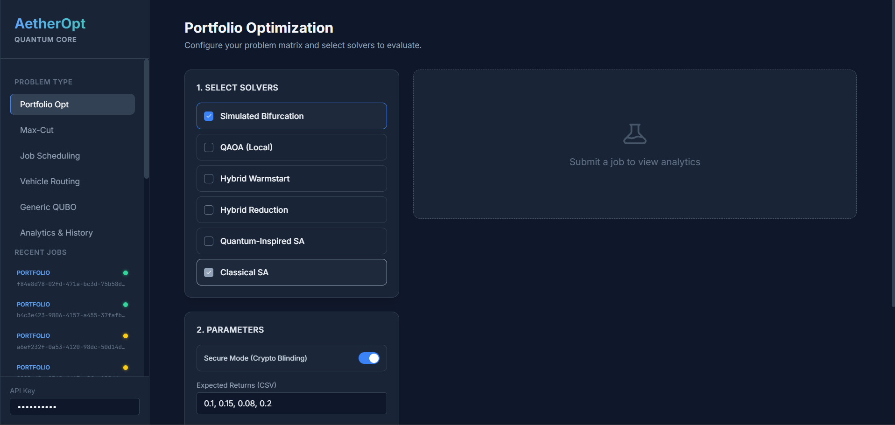

<div align="center">
  <a href="README.md"><b>README</b></a> &nbsp; | &nbsp;
  <a href="architecture.md"><b>Architecture</b></a> &nbsp; | &nbsp;
  <a href="LICENSE.md"><b>License</b></a>
</div>

<br/>

<div align="center">
  <h1>AetherOpt</h1>
  <p><b>Production-Grade Quantum-Inspired Optimization Platform</b></p>
  
  
  
</div>

<br/>

AetherOpt is an end-to-end framework and API for mapping hard combinatorial problems to Quadratic Unconstrained Binary Optimization (QUBO) and solving them using classical, quantum-inspired, and quantum solvers. 

It is designed with stability, asynchronous execution, and rigorous data validation to serve as a robust backend for production workloads, integrating **Cryptography** and **Data Science** pipelines directly into the optimization workflows.

---

## Interactive Web Interface



---

## Features

- **Asynchronous Execution:** Safely run long combinatorial solves in the background with a thread-safe SQLAlchemy integration.
- **Strict Data Validation:** Comprehensive Pydantic models for all problem domains (Portfolio, Max-Cut, Routing, Scheduling) ensuring fail-fast validation. Support for multi-objective & PUBO schemas.
- **Multiple Solvers:**
  - **Simulated Bifurcation:** High-performance quantum-inspired solver for dense QUBOs.
  - **QAOA (Local):** Local quantum circuit simulation for Exact QAOA algorithms.
  - **Hybrid Quantum-Classical Pipeline:** Seed classical refinement (like SA or HiGHS) with states found by quantum/quantum-inspired solvers.
  - **Correlation Reduction:** Freeze variables dynamically based on spin correlation to reduce search space.
  - **Quantum-Inspired SA:** Simulated annealing enhanced with barrier tunneling probability bounds.
  - **Classical SA & HiGHS:** Fast, traditional baselines and exact MIP solving.
- **Cryptography Layer (Secure QUBO):** Submit blind optimization jobs. Matrix coefficients are scalar-blinded before reaching the solver to ensure mathematical privacy.
- **Data Science Layer:** Automated experiment tracking (SQLite/MLflow concepts) to save run configurations, energies, and metadata across experiments.

---

## Getting Started

### 1. Installation

Clone the repository and ensure you have `uv` installed (if not: `pip install uv`).

```bash
uv sync
```

### 2. Run the Server

Start the application with both the frontend and API exposed on port 8000:

```bash
uv run aetheropt
```

### 3. Interactive Web UI
Visit [http://localhost:8000](http://localhost:8000) to access the interactive web interface, where you can define matrices and submit jobs seamlessly.

---

## Interactive API Usage

> [!NOTE] 
> The `X-API-Key` is configured to `secret_key` for local development by default. When deploying to production, enforce a secure token by setting the `API_KEY` environment variable and changing `AETHEROPT_ENV=production`.

You can also submit jobs directly via curl. Try out this Portfolio Optimization problem!

<details>
<summary><b>Show cURL Example</b></summary>

```bash
curl -X 'POST' \
  'http://localhost:8000/api/v1/jobs/' \
  -H 'accept: application/json' \
  -H 'X-API-Key: secret_key' \
  -H 'Content-Type: application/json' \
  -d '{
  "problem_type": "portfolio",
  "data": {
    "expected_returns": [0.1, 0.2],
    "covariance_matrix": [[0.04, 0.01], [0.01, 0.05]],
    "k": 1,
    "risk_aversion": 0.5
  },
  "solvers": [
    "simulated_bifurcation",
    "quantum_warmstart",
    "highs"
  ],
  "config": {
    "num_reads": 10,
    "num_steps": 1000,
    "secure": true
  }
}'
```

</details>

After receiving a Job ID, poll the results:

```bash
curl -H 'X-API-Key: secret_key' http://localhost:8000/api/v1/results/{YOUR_JOB_ID}
```

---

## Architecture

Curious about how AetherOpt processes jobs and maps domains to QUBOs with crypto layers? 
**Check out the [Architecture Overview](architecture.md).**

## Testing

Execute the comprehensive test suite locally:

```bash
uv run pytest
```
