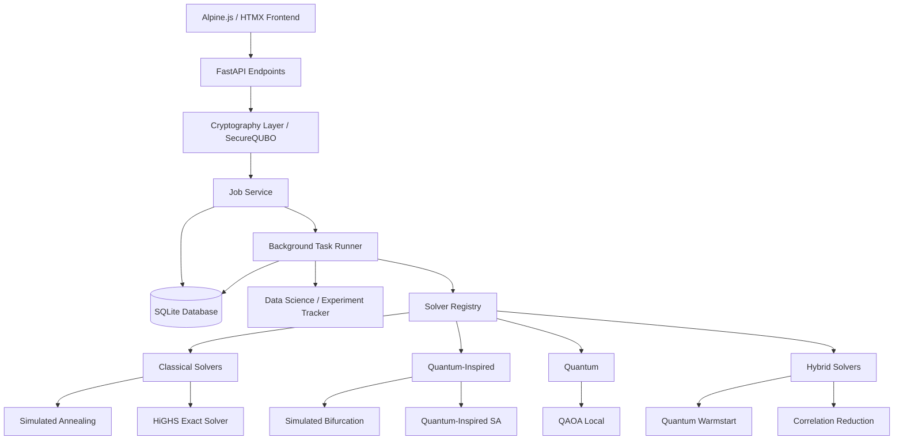

<div align="center">
  <a href="README.md"><b>📖 README</b></a> &nbsp; | &nbsp;
  <a href="architecture.md"><b>🏗️ Architecture</b></a> &nbsp; | &nbsp;
  <a href="LICENSE.md"><b>⚖️ License</b></a>
</div>

<br/>

# AetherOpt Architecture

AetherOpt is structured as a modern, asynchronous, Python-based API designed for combinatorial optimization workloads. It bridges the gap between quantum-inspired algorithms, exact operations research, and cryptographic layers by providing a unified interface to formulate and solve NP-hard problems.

## System Overview



## Core Components

### 1. API Layer (`aetheropt/api/`)
FastAPI routers handling incoming HTTP requests. Models are validated using Pydantic, ensuring strictly typed data before it reaches the core system.

### 2. Validation & Security (`aetheropt/core/` and `aetheropt/crypto/`)
Problems are validated, API Keys are checked, and optional quantum-safe cryptography operations (e.g., QUBO coefficient scalar blinding via `SecureQUBO`) are applied to the objective matrices before they are sent to the solver engine.

### 3. Data Science Pipeline (`aetheropt/datascience/`)
An integrated pipeline for feature engineering, pre-processing, ML surrogate models, and rigorous experiment tracking. The `ExperimentTracker` saves run configurations and solver metadata directly to the database.

### 4. Background Job Management (`aetheropt/services/job_service.py`)
Heavy lifting is offloaded to `BackgroundTasks`. The service retrieves the problem payload, encrypts it if requested, pushes it to the solver orchestrator, decodes the result, and logs the status to SQLite.

### 5. Multi-Paradigm Solvers (`aetheropt/solvers/`)
The solver engine features four primary domains, seamlessly resolved through a central `SolverRegistry`:
- **Classical**: Exact solvers (HiGHS) and classical SA.
- **Quantum-Inspired**: High-performance classical heuristic simulators (Simulated Bifurcation).
- **Quantum**: State-vector QAOA local simulations using Qiskit Aer.
- **Hybrid**: Pipelines that chain solvers together. E.g., `QuantumWarmstartSolver` uses a quantum algorithm to estimate the ground state and seeds it into a classical solver for rapid refinement.

### 6. Domain Models (`aetheropt/problems/`)
All real-world combinatorial problems are mapped into Quadratic Unconstrained Binary Optimization (QUBO) structures. Support exists for standard matrices, Multi-Objective mapping, and Polynomial (PUBO) models.
- **Portfolio Optimization**: Maps covariance and expected returns to a QUBO maximizing returns while penalizing risk.
- **Vehicle Routing & Scheduling**: Constrained graphs reduced to binary penalties.
- **Max-Cut**: Standard graph partitioning formulation.

### 7. Background Execution & State Management
Combinatorial solving is CPU-bound and blocks the event loop.
- **FastAPI BackgroundTasks** dispatches solvers to a separate thread.
- **Database Thread Safety**: We use a `get_db_session()` context manager inside the background workers to ensure SQLAlchemy `Session` objects are strictly isolated per-thread, avoiding silent SQLite crashes.

## Project Structure

```
AetherOpt/
├── aetheropt/
│   ├── api/          # FastAPI Routes (Jobs, Results)
│   ├── core/         # Security, Dependencies
│   ├── crypto/       # Hash commitments, Secure QUBO, PQ-Wrappers
│   ├── datascience/  # Experiment tracking, Analysis, Visualization
│   ├── db/           # SQLAlchemy Models, Session Engine
│   ├── models/       # Pydantic Schemas (Strict Validation)
│   ├── problems/     # QUBO Formulations (Portfolio, Routing...)
│   ├── services/     # Job orchestration and db logic
│   ├── solvers/      # The algorithmic cores (QAOA, SB, Hybrid, Highs)
│   ├── static/       # Alpine.js Frontend UI
│   └── main.py       # Application Entrypoint
├── tests/            # Pytest Suite (Unit & E2E)
├── config.py         # Environment configuration
└── pyproject.toml    # uv / python metadata
```
