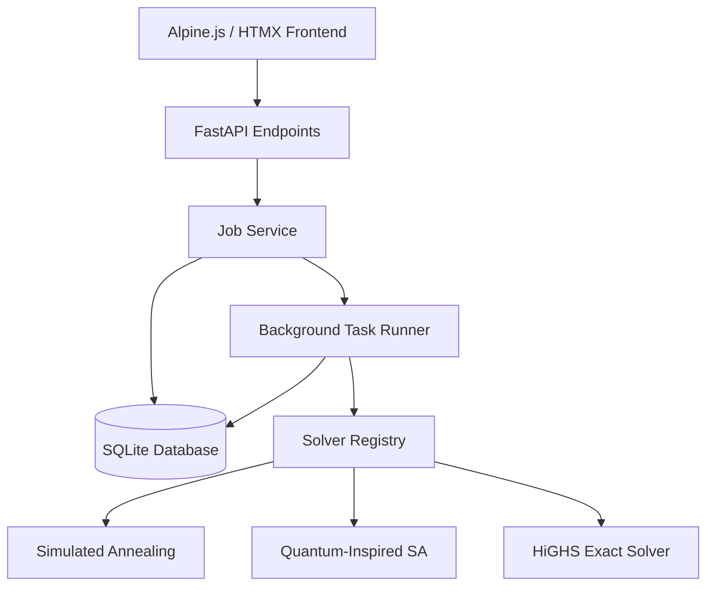

# AetherOpt Architecture

AetherOpt is structured as a modern, asynchronous, Python-based API designed for combinatorial optimization workloads. It bridges the gap between quantum-inspired algorithms and classical operations research by providing a unified interface to formulate and solve NP-hard problems.

## System Overview



## Core Components

### 1. API Layer (`aetheropt/api/`)
- Built with **FastAPI**.
- Implements strict Pydantic validation. The models in `aetheropt/models/problem.py` use discriminated unions to dynamically route requests based on `problem_type` (e.g., `portfolio`, `routing`).
- `v1/jobs.py` handles the `POST` acceptance (returns `202 Accepted`), spawning a background task.
- `v1/results.py` allows asynchronous polling of completed solver states.

### 2. Domain Models (`aetheropt/problems/`)
All real-world combinatorial problems are mapped into Quadratic Unconstrained Binary Optimization (QUBO) structures.
- **Portfolio Optimization**: Maps covariance and expected returns to a QUBO maximizing returns while penalizing risk.
- **Vehicle Routing & Scheduling**: Constrained graphs reduced to binary penalties.
- **Max-Cut**: Standard graph partitioning formulation.

### 3. Solver Registry (`aetheropt/solvers/`)
All solvers inherit from `BaseSolver` and implement a `.solve(Q, config)` method, returning a unified `SolverResultData`.
- **Classical SA**: Pure simulated annealing.
- **Quantum-Inspired SA**: Simulated annealing incorporating quantum tunneling approximations to escape local minima, bounded by barrier heights.
- **HiGHS Solver**: Translates QUBOs into Mixed Integer Programming (MIP) problems. Highs provides exact verification for smaller problem sizes ($n < 100$).

### 4. Background Execution & State Management
Combinatorial solving is CPU-bound and blocks the event loop.
- **FastAPI BackgroundTasks** dispatches solvers to a separate thread.
- **Database Thread Safety**: We use a `get_db_session()` context manager inside the background workers to ensure SQLAlchemy `Session` objects are strictly isolated per-thread, avoiding silent SQLite crashes.

## Project Structure

```
AetherOpt/
├── aetheropt/
│   ├── api/          # FastAPI Routes (Jobs, Results)
│   ├── core/         # Security, Dependencies
│   ├── db/           # SQLAlchemy Models, Session Engine
│   ├── models/       # Pydantic Schemas (Strict Validation)
│   ├── problems/     # QUBO Formulations (Portfolio, Routing...)
│   ├── services/     # Job orchestration and db logic
│   ├── solvers/      # The algorithmic cores (SA, Highs)
│   ├── static/       # Alpine.js Frontend UI
│   └── main.py       # Application Entrypoint
├── tests/            # Pytest Suite (Unit & E2E)
├── config.py         # Environment configuration
└── pyproject.toml    # uv / python metadata
```

## Concurrency Model
AetherOpt handles synchronous requests quickly by persisting a `Job` record in `pending` status. The background task modifies the state to `running`, executes the solvers in series (or parallel, in future iterations), and commits the `completed` state containing a JSON serialization of all solver metadata and execution times.
